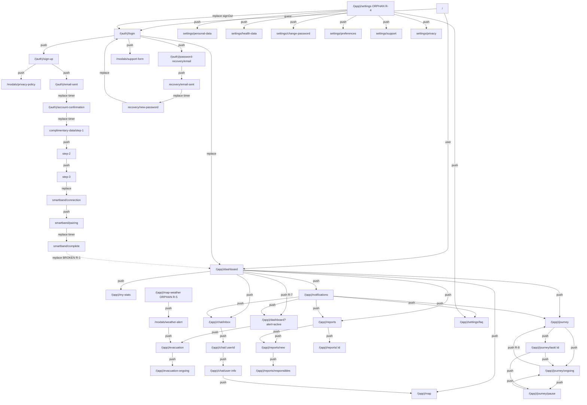

# SWI Mobile — Code Review + Mapa Oficial de Rotas

**Data:** 2026-05-17
**Worktree:** `C:\Users\Gabriel\Documents\SWI-mobile`
**Branch:** `feat/mobile-login`
**Escopo:** Revisão file-by-file de toda a árvore `mobile/` + documento oficial de roteamento Expo Router.
**Fase do produto:** Demo frontend-only — sem backend, sem auth real, sem BLE/maps nativos. Decisão validada com o usuário; não tratar ausência de integração como bug.

> **Relação com outros docs:** O audit `docs/audits/mobile/2026-05-15/app-routes-fidelity.md` cobre fidelidade Figma per-screen. Este doc cobre **arquitetura, navegação e qualidade de código** — complementar, não duplicado.

---

## 0. Sumário Executivo

### O que está bem
- **Design System rigoroso.** Nenhuma tela do cluster `(auth)` ou `(onboarding)` tem cor hardcoded. `useTheme()` é consumido como tokens-only padrão. Violações pontuais nos clusters de mapa (`#3BC958`, `#8AD2E2`, `#50B3D2`, `#1E652C`) — todas justificáveis por Figma pixel-perfect mas catalogadas abaixo.
- **Platform-suffix architecture (Map\*)** é a melhor parte da arquitetura. Barrels TS-only + variantes `.web` + `.native` resolvem o `document is not defined` sem fragmentar o call site. `evacuation.tsx` provou o contrato declarativo end-to-end.
- **Feature flags isoladas** em `lib/featureFlags.ts`, consumidas uniformemente via `isFeatureEnabled(gate)` (nunca via `IS_PROD_BUILD` direto). `MANUAL_OVERRIDE = null` — não há override esquecido.
- **Modais com dual-shape** (rota wrapper + componente reutilizável em `components/modals/`) — funciona em `privacy-policy`, `support-form` e `responsibles`.

### O que precisa ação imediata
| # | Severidade | Arquivo | Problema |
|---|---|---|---|
| **R-1** | Crítico | `mobile/app/(onboarding)/smartband/complete.tsx:59` | Fluxo de signup nunca chama `signIn()`. `router.replace('/(app)/dashboard')` cai no auth gate e volta pra `/login`. **Dashboard inalcançável via cadastro.** |
| **R-2** | Crítico | `mobile/components/Smartwatch3D.native.tsx:49-61` | Rules of Hooks: `useRef`/`useState` chamados **depois** de `return` condicional pelo feature gate. Crash garantido se o gate alternar. |
| **R-3** | Crítico | `mobile/components/MapMarker.web.tsx:31-50` | `root.render(children)` só roda no mount. Mudança de visual (ex: status `good` -> `alert`) **não atualiza no web**, atualiza no native. Divergência silenciosa entre plataformas. |
| **R-4** | Crítico | `mobile/app/(app)/settings/index.tsx` | Tela órfã. **Nenhum botão do app navega pra `/(app)/settings`**. Dashboard não tem ícone de settings; NavFABs também não. Settings só é alcançável por deep-link. |
| **R-5** | Crítico | `mobile/app/(app)/map-weather.tsx` | Tela órfã. Nenhuma navegação aponta pra `/(app)/map-weather`. Notificação de "alerta meteorológico" leva pra `/(app)/dashboard?alert=active`, não pra map-weather. |
| **R-6** | Alto | `mobile/app/modals/weather-alert.tsx` | Quebra do contrato dual-shape: UI inline dentro da rota, sem `components/modals/WeatherAlertModal.tsx`. Não é reusável fora da rota. |
| **R-7** | Alto | `mobile/app/(app)/dashboard.tsx:372, 713` | `router.push('/(app)/dashboard?alert=active')` e `router.push('/(app)/dashboard')` empilham instâncias duplicadas. Use `router.replace`. |
| **R-8** | Alto | `mobile/app/(app)/journey/ongoing.tsx:241` | "Finalizar Jornada" usa `router.push('/(app)/journey')` — empilha planner sobre ongoing. Deve ser `router.replace` ou `router.back()`. |
| **R-9** | Alto | `mobile/app/(app)/map.tsx:301-308, 377-419` | `<div>` puro e `linear-gradient` CSS em arquivo que compila pra native bundle. Sem `Platform.select`, crash no Android/iOS quando o feature gate de maps abrir. Mesma situação em `map-weather.tsx` e `evacuation-ongoing.tsx`. |
| **R-10** | Alto | `mobile/app/(auth)/complimentary-data/step-1,2,3` | Botão "Avançar/Concluir" **sem validação alguma** — usuário pode passar pelas 3 etapas com todos os campos vazios. Inconsistente com login/sign-up/recovery que têm `canSubmit`. |

### Métricas
- **Telas Expo Router:** 53 arquivos `.tsx` em `app/`
- **Rotas únicas:** 39 (auth: 10, onboarding: 3, app: 23, modais: 3, root: 3)
- **Components shared:** 17 (12 são variantes web/native dos 3 primitivos de mapa)
- **Lib utilities:** 5
- **Feature gates ativos:** 4 (`smartbandOnboarding`, `maps`, `notifications`, `smartwatch3d`)
- **Telas atrás de gate:** 8 (todas viram `<ProdOnlyPlaceholder />` em Expo Go / web)
- **Telas órfãs (sem inbound nav):** 2 (`settings/index`, `map-weather`)

---

## 1. Stack e Configuração

### 1.1 Dependencies (críticas)
- `expo@~54.0.33` + `expo-router@~6.0.23` (typed routes habilitado em `app.json:37`)
- `react@19.1.0` + `react-native@0.81.5` (new arch **desligada** em `app.json:10`)
- `@kavicki/swi-design-system` pinado em `github:Kavicki-com/swi-design-system#v0.1.47`
- `@maplibre/maplibre-react-native@11.2.1` (nativo) + `maplibre-gl@4.7.1` (web)
- `@react-three/fiber@8` + `@react-three/drei@9` + `expo-gl@~16` + `expo-three@8` (smartwatch 3D)

### 1.2 Root Layout (`mobile/app/_layout.tsx`)
- Splash screen retida até fontes carregarem **OU** timeout de 5s (defesa contra Google Fonts offline).
- Fontes: 6 variantes (Inter 400/500/700, Montserrat 400/500/700). Mapeamento custom: `'Montserrat'` aliasado pra `Montserrat_700Bold` porque o DS usa Montserrat exclusivamente para títulos/buttons em weight 700.
- Hierarquia de providers: `GestureHandlerRootView` -> `SafeAreaProvider` -> `SwiThemeProvider` -> `AuthProvider` -> `<Stack>`.
- Stack raiz declara 3 grupos (`(auth)`, `(onboarding)`, `(app)`) + 3 modais (`modals/support-form`, `modals/privacy-policy`, `modals/weather-alert`). Todos `presentation: 'transparentModal'`.

### 1.3 Auth Provider (`mobile/services/auth/AuthProvider.tsx`)
- **In-memory only**, sem AsyncStorage. Cold start sempre = não logado.
- `signIn(email)` fake: cria `{ id: '1', email, name: email.split('@')[0] }`.
- **`signIn` só é chamado em `login.tsx:21`.** Nenhum outro fluxo (signup, recovery) chama. Ver R-1.

### 1.4 Feature Flags (`mobile/lib/featureFlags.ts`)
- `IS_PROD_BUILD = MANUAL_OVERRIDE ?? autodetect`
- `autodetect`: `Platform.OS === 'web' -> false`; native `Constants.executionEnvironment === 'standalone' | 'bare' -> true`; senão (`storeClient` = Expo Go) -> `false`.
- Todos os 4 gates (`smartbandOnboarding`, `maps`, `notifications`, `smartwatch3d`) ligados em `IS_PROD_BUILD` — não há gate seletivo.

### 1.5 Metro / Expo
- `metro.config.js` estende default Expo + adiciona assetExts: `glb`, `gltf`, `bin`, `hdr` (pra Smartwatch3D nativo).
- `expo.experiments.typedRoutes: true` — `useLocalSearchParams` é tipado quando você usa `useLocalSearchParams<{ x: string }>()`.
- `expo-router` usa `expo-router/entry` como main, não há `index.js`.

---

## 2. Code Review por Camada

### 2.1 Cluster `(auth)/` — 10 telas

#### `app/(auth)/_layout.tsx`
Passthrough Stack, `headerShown: false`. Sem guards aqui (auth gate fica em `(app)/_layout.tsx`).

#### `app/(auth)/login.tsx`
- Form email + senha, CTA "Entrar" `variant="contained"` (verde — correto pra cadastro/auth).
- Nav OUT: `router.replace('/(app)/dashboard')`, `router.push('/(auth)/password-recovery/email')`, `router.push('/(auth)/sign-up')`, `router.push('/modals/support-form')`.
- `signIn(email)` descarta `password` silenciosamente (linha 21). Demo OK, comentário ajudaria.
- Sem `KeyboardAvoidingView`. Sem `onSubmitEditing` chain entre os 2 inputs.
- `canSubmit` checa `email.length > 0` — sem regex de email.

#### `app/(auth)/sign-up.tsx`
- Form 4 campos + checkbox T&C. CTA "Criar conta" verde.
- Nav OUT: `router.push({ pathname: '/(auth)/email-sent', params: { email, username } })`, `router.push('/modals/privacy-policy')`, `router.back()`.
- `validatePassword` duplicado de `password-recovery/new-password.tsx`.
- Sem `KeyboardAvoidingView`, sem chain de `returnKeyType`.

#### `app/(auth)/account-confirmation.tsx`
- Splash de sucesso, auto-redireciona em 2.5s.
- Nav OUT: `router.replace({ pathname: '/(auth)/complimentary-data/step-1', params: { username } })`.
- `router` no deps do `useEffect` (linha 28) — cheiro de dep.
- `clearTimeout` cleanup correto.

#### `app/(auth)/email-sent.tsx`
- Holding screen 4s antes de seguir pra `account-confirmation`.
- Nav OUT: `router.replace({ pathname: '/(auth)/account-confirmation', params: { username } })`.
- Sem botão de "Reenviar email" — se o usuário errou o email não tem escape.
- Comentário no topo contradiz comentário do `sign-up.tsx:52` sobre existência de botão "Já confirmei". Decidir.

#### `app/(auth)/complimentary-data/_layout.tsx`
Passthrough.

#### `app/(auth)/complimentary-data/step-1.tsx`
- Dados pessoais (nome, telefone, CPF, DOB, foto).
- Nav OUT: `router.push({ pathname: 'step-2', params: { username } })`, `router.back()`.
- **Zero validação** — "Avançar" sempre habilitado. **R-10**.
- Sem máscara em CPF/telefone.
- `router.push` empilha — back-stack acumula step-1 -> step-2 -> step-3. Se wizard é "forward-only" (StepBar sugere), use `router.replace`.

#### `app/(auth)/complimentary-data/step-2.tsx`
- Endereço (CEP, rua, número, bairro, UF).
- Nav OUT: `router.push({ pathname: 'step-3' })`, `router.back()`.
- Zero validação. CEP sem máscara nem autofill ViaCEP.

#### `app/(auth)/complimentary-data/step-3.tsx`
- Dados de saúde (gender, altura, peso, sangue, alergias, condições, deficiência).
- Nav OUT: **`router.replace('/(onboarding)/smartband/connection')`**, `router.back()`.
- Zero validação.
- `router.replace` correto — limpa wizard do stack.

#### `app/(auth)/password-recovery/_layout.tsx`
Passthrough.

#### `app/(auth)/password-recovery/email.tsx`
- Form de email.
- Nav OUT: `router.push({ pathname: 'email-sent', params: { email } })`.
- Deveria ser `router.replace` — depois do timer chain pra new-password, OS back volta pro email input em vez de pra login.

#### `app/(auth)/password-recovery/email-sent.tsx`
- Holding 4s pra `new-password`.
- Nav OUT: `router.replace({ pathname: 'new-password', params: { email } })`.
- `email` param é passado mas `new-password.tsx` não lê — dead param.
- Copy idêntica à do sign-up email-sent ("clique para confirmar a sua conta") — não é apropriado pra recovery.

#### `app/(auth)/password-recovery/new-password.tsx`
- Form nova senha + confirma.
- Nav OUT: `router.replace('/(auth)/login')`.
- `validatePassword` duplicado.
- Sem confirmação visual (toast/screen de sucesso) antes de despejar no login.

---

### 2.2 Cluster `(onboarding)/` — 3 telas

#### `app/(onboarding)/_layout.tsx` + `smartband/_layout.tsx`
Ambos passthrough.

#### `app/(onboarding)/smartband/connection.tsx`
- Lista de permissões BLE/localização + CTAs.
- **Feature gate:** `smartbandOnboarding`.
- Nav OUT: `router.push('/(onboarding)/smartband/pairing')`.
- Gate fica dentro do componente — quando false, `step-3` já replaceu pra cá e o usuário vê `ProdOnlyPlaceholder`. Gate deveria estar **na chamada** ou em layout.

#### `app/(onboarding)/smartband/pairing.tsx`
- Animação 3D + progress bar.
- Nav OUT: `router.replace('/(onboarding)/smartband/complete')`.
- **Mesmo padrão Rules of Hooks** que Smartwatch3D.native — `isFeatureEnabled` no topo, early return condicional. Estruturalmente frágil.
- Dois `useEffect` separados, segundo dispara em todo tick de progress (mesmo após chegar em 1).

#### `app/(onboarding)/smartband/complete.tsx`
- Sucesso, "Finalizar".
- Nav OUT: **`router.replace('/(app)/dashboard')`**.
- **R-1: `useAuth().signIn()` nunca foi chamado no fluxo de signup.** Replace pra dashboard cai no auth gate de `(app)/_layout.tsx` e redireciona pra `/login`. Cadastro inteiro morre aqui.

---

### 2.3 Cluster `(app)/` — 26 telas

#### `app/(app)/_layout.tsx`
**Auth gate:** `if (!user) return <Redirect href="/(auth)/login" />`. Demo phase = sem AsyncStorage, então cold start sempre cai em login.

#### `app/(app)/dashboard.tsx`
- Tela raiz autenticada. Renderiza StatusChart + vitals + ações + (condicionalmente) AlertActiveView via `?alert=active`.
- Nav OUT: 7 destinos (my-stats, map, journey, reports, notifications, chat/inbox, dashboard?alert=active).
- **R-7:** `router.push('/(app)/dashboard?alert=active')` (linha 372) e `router.push('/(app)/dashboard')` (linha 713) empilham. Use `replace`.
- SVG gradient com hex hardcoded `#3BC958` / `#1E652C` (115-116) e `#171717` / `#62BB81` (431-436). Justificáveis por Figma mas vale token.

#### `app/(app)/my-stats.tsx`
- Estatísticas pessoais — donut grid 4 charts, line chart calorias, allergies chips, exam history.
- Nav OUT: `router.push('/(app)/dashboard')` (Home FAB).
- `CALORIES_POINTS` tem entrada duplicada (`18:54 -> 49 kcal` em índices 5 e 6).
- `ExamInfoCard.year` recebe `string` aqui e `number` em `settings/health-data.tsx`. Inconsistência de tipo.

#### `app/(app)/evacuation.tsx`
- **Tela piloto da migração declarativa.** `<MapView>` + 4× `<MapMarker>` + `<MapLineSource>`. Rota OSRM com cache + fallback.
- **Feature gate:** `maps`.
- Nav OUT: `router.push('/(app)/evacuation-ongoing')`.
- `ChipBody` duplicado em `evacuation-ongoing.tsx`.
- Promise sem `.catch()` — depende do fallback de `getEvacuationRoute` nunca rejeitar.
- Hex `#8AD2E2` hardcoded pra polyline.

#### `app/(app)/evacuation-ongoing.tsx`
- Navegação ativa. Polyline roxa + nav-arrow marker animado.
- **Feature gate:** `maps`. **Map API:** legacy `onReady` imperativo. **NÃO migrado.**
- Nav OUT: nenhuma direta. Saídas só via NavFABs (Home/Chat).
- **R-9:** `createRoot` de `react-dom/client` (linha 9) — não existe no native. Hoje só roda em web; se gate inverter, crash no nativo.
- `ChipBody` duplicado.
- `NAV_ARROW_FILL = '#50B3D2'` hardcoded.

#### `app/(app)/map.tsx`
- Mapa geral — 3 overlays toggleáveis (operadores/heatmap/câmeras).
- **Feature gate:** `maps`. **Map API:** legacy `onReady` imperativo. **NÃO migrado.**
- Nav OUT: nenhuma; via NavFABs.
- **R-9:** `<div>` puro em JSX (301-308 scrim, 377-419 legenda) + CSS `linear-gradient`. Vai crashar no nativo se gate abrir.
- `buildHeatmapPoints` duplicado com `map-weather.tsx`.

#### `app/(app)/map-weather.tsx`
- Mapa meteorológico — 2 heatmaps + 11 pinos de alerta + câmeras.
- **Feature gate:** `maps`. **Map API:** legacy `onReady` imperativo. **NÃO migrado.**
- Nav OUT: `router.push('/modals/weather-alert')` (clique no pino).
- **R-5: Tela órfã.** Nenhum inbound nav. Notificação meteorológica vai pra `/dashboard?alert=active`, não aqui.
- **R-9:** mesmo problema de `createRoot` que `map.tsx`/`evacuation-ongoing.tsx`.

#### `app/(app)/notifications.tsx`
- Lista de 12 cards com routing per-card.
- **Feature gate:** `notifications`.
- Nav OUT: 5 destinos (`dashboard?alert=active`, `chat/inbox`, `reports`, `journey`, `settings/faq`).
- Botão `more_vert` duplica `onPress` do card — risco de double-tap se overlap.

#### Chat (3 telas)
- **`chat/inbox.tsx`** — 15 contatos, busca, scrollbar custom, "Novo Chat".
  - Nav OUT: `router.push(\`/(app)/chat/${u.id}\`)` (dinâmico).
- **`chat/[userId].tsx`** — thread. **Param `userId` ignorado** (atribuído a `_userId`). Todos os usuários abrem a mesma conversa estática.
  - Nav OUT: `router.push('/(app)/chat/user-info')`.
  - Send button `onPress={() => {}}` silencioso.
  - Separador "Hoje - 21/03/2026" hardcoded entre msg 1 e 2.
- **`chat/user-info.tsx`** — perfil. Sempre mostra Romulo Cardoso (param ignorado).
  - Nav OUT: `router.push('/(app)/map')`.

#### Journey (4 telas)
- **`journey/index.tsx`** — planner. 4 tasks, "Iniciar Jornada".
  - Nav OUT: `router.push({ pathname: '/(app)/journey/task/[id]', params: { id } })`, `router.push('/(app)/journey/ongoing')`.
- **`journey/ongoing.tsx`** — em andamento.
  - Nav OUT: `router.push('task/[id]')`, `router.push('/(app)/journey')` (finalizar), `router.push('/(app)/journey/pause')` (pausar).
  - **R-8:** Finalizar usa `push` em vez de `replace`/`back` — empilha planner sobre ongoing.
- **`journey/pause.tsx`** — pausado.
  - Nav OUT: `router.push('task/[id]')`, `router.push('/(app)/journey/ongoing')` (retomar).
  - "Finalizar Jornada" disabled mas tem `onPress={() => {}}`.
- **`journey/task/[id].tsx`** — detalhe.
  - Nav OUT: `router.back()`, `router.push('/(app)/journey/ongoing')` (finalizar/cancelar), `router.push('/(app)/journey/pause')` (pausar), self-push com `state: 'ongoing'`.
  - Self-push deveria ser `router.replace` com params atualizados.
  - Sem NavFABs (todas as outras journey têm).
- **Duplicação massiva:** `TASKS`/`ACTIVE_TASK`/`UPCOMING_TASKS` redeclarados verbatim em 4 arquivos. -> `lib/journeyMockData.ts`.

#### Reports (4 telas)
- **`reports/index.tsx`** — lista 10 relatórios + busca + paginação (ambas não funcionais).
  - Nav OUT: `router.push('/(app)/reports/new')`, `router.push({ pathname: '/(app)/reports/[id]', params: { id } })`.
- **`reports/[id].tsx`** — detalhe.
  - Nav OUT: `router.back()`.
  - Dicionário `REPORTS` cobre só 2 dos 10 IDs — outros 8 fallback pra "Inspeção Técnica" silenciosamente.
- **`reports/new.tsx`** — formulário novo + abre modal de responsáveis.
  - Nav OUT: `router.push('/(app)/reports/responsibles')`, `router.back()` (save & cancel — ambos idênticos).
  - `responsiblesSelection` singleton mutável module-level.
- **`reports/responsibles.tsx`** — wrapper transparent modal de `ResponsiblesModal`. Delegação limpa.

#### Settings (8 telas)
- **`settings/index.tsx`** — hub: avatar, 6 cards menu, sign-out.
  - **R-4: Tela órfã**. Nenhum botão do app navega pra `/(app)/settings`.
  - Nav OUT: 7 destinos internos + `router.replace('/(auth)/login')` (signOut — correto) + `router.push('/(app)/dashboard')`.
  - `go(href)` cast `as never` bypassa typed routes.
- **`settings/faq.tsx`** — Accordion list + busca/paginação não funcionais.
- **`settings/health-data.tsx`** — form com 2 Combobox vazios.
- **`settings/personal-data.tsx`** — form com 4 Combobox vazios.
- **`settings/preferences.tsx`** — 4 Toggles. Limpo.
- **`settings/privacy.tsx`** — wrapper transparent modal de `PrivacyPolicyModal`.
- **`settings/support.tsx`** — wrapper transparent modal de `SupportFormModal`.
- **`settings/change-password.tsx`** — 3 inputs senha + toggle visibility + Toast.
  - "Salvar" sem validação alguma.
  - Botão posicionado `bottom: insets.bottom + 120` hardcoded.

---

### 2.4 Modais (rotas + componentes)

#### `app/modals/privacy-policy.tsx` -> `components/modals/PrivacyPolicyModal.tsx`
Delegação correta. `POLICY` é string 1700+ chars hardcoded no componente — Phase 2 deve vir de API.

#### `app/modals/support-form.tsx` -> `components/modals/SupportFormModal.tsx`
Delegação correta. `Combobox options={[]}` sem TODO. Submit `onPress={onClose}` sem validação.

#### `app/modals/weather-alert.tsx`
- **R-6: UI inline na rota, sem componente em `components/modals/`.** Quebra contrato dual-shape.
- Nav OUT: `router.push('/(app)/evacuation')`.
- Dados meteorológicos hardcoded (17ºC, 65%, 65km/h, etc.) sem comentário stub.

#### `components/modals/ResponsiblesModal.tsx`
- Bottom sheet + 5 admins + checkbox múltipla.
- `responsiblesSelection` singleton mutável + `_selectedIds` sem cleanup quando usuário abandona sem confirmar.
- `ADMINS` data co-localizado no componente (deveria estar em `lib/`).

---

### 2.5 Componentes Compartilhados

#### `components/OnboardingHeader.tsx`
- `<Title variant="title.l">` aninha `<Title variant="title.s">` como child. Se DS renderiza `<View>` internamente, vai dar warning "Text must be inside Text". Verificar.

#### `components/NavFABs.tsx`
- Cluster duplo FAB (Chat à direita, Home centralizado).
- Mounted screen-by-screen (sem layout-level). Telas que esquecem: `my-stats`, `chat/[userId]`, `chat/user-info`, `reports/[id]`, `journey/task/[id]`.
- Em telas estreitas, Chat FAB pode sobrepor Home FAB.

#### `components/ProdOnlyPlaceholder.tsx`
Limpo. `router.canGoBack()` guard correto. 100% tokens DS.

---

### 2.6 Map Components (Platform-Suffix Architecture)

#### `MapView.tsx` (barrel) / `.web.tsx` / `.native.tsx`

**Drift de API:**
| Prop | `.web` | `.native` | Drift? |
|---|---|---|---|
| `center` | `[lng, lat]` required | `[lng, lat]` required | — |
| `zoom` | `number?` default 14 | `number?` default 14 | — |
| `onReady` | `(map, lib) => void` | **`unknown`** | Tipo enfraquecido |
| `children` | `ReactNode?` | `ReactNode?` | — |
| `testID` | `string?` | `string?` | — |

- `MapInstanceContext` exportado só de `.web` — se alguém importar do barrel, `undefined` em runtime.
- `onReady: unknown` mente: aceita qualquer valor sem feedback. Use `never` ou tipo idêntico ao web.

#### `MapMarker.tsx` (barrel) / `.web.tsx` / `.native.tsx`

- **R-3:** `MapMarker.web.tsx:31-50` — `root.render(children)` só roda no mount. Mudanças de child silenciosamente ignoradas.
- `id` prop aceita no tipo mas descartada no `.web` — divergência silenciosa com native.

#### `MapLineSource.tsx` (barrel) / `.web.tsx` / `.native.tsx`

- Tipos copy-paste idênticos entre web e native -> extrair `MapLineSource.types.ts`.
- `shape` no dep array do `useEffect` web — reference equality, footgun se caller passar objeto novo a cada render.

#### `Smartwatch3D.tsx` (barrel) / `.web.tsx` / `.native.tsx` / `.types.ts`

- **Único barrel que faz isso certo** — `.types.ts` separado.
- **R-2:** `.native.tsx:49-61` — Rules of Hooks violation.
- `require('../assets/smartwatch.glb')` no module scope — incluído no bundle native sempre, mesmo com gate off.

---

### 2.7 Lib

#### `lib/featureFlags.ts`
Consumidores: 9 telas. Uso consistente via `isFeatureEnabled(gate)`.

#### `lib/evacuationRouteCache.ts`
Cache + inFlight dedup. Limpo. Sem TTL/invalidação — fine pra demo.

#### `lib/mapMockData.ts`
- Typed, ReadonlyArray, coords `[lng, lat]` consistentes.
- **`fetchEvacuationRoute` faz HTTP real pra `router.project-osrm.org`** — não é "mock". Renomear ou mover pra `lib/api/`.
- Nomes brasileiros plausíveis (Carlos Silva, Mariana Souza, ...) — adicionar comentário "dados fictícios" no topo.

#### `lib/mapStyle.ts`
ESRI satellite spec. URL sem token — ToS ArcGIS exige registro em produção.

#### `lib/useMapLibre.ts`
- Lazy-load de `maplibre-gl` + CSS.
- `inFlight` nunca volta pra `null` após resolução — leak de Promise no module scope.

---

## 3. Mapa Oficial de Rotas (Node-by-Node)

Convenções:
- `↦ PUSH` = empilha no stack
- `↦ REPLACE` = substitui topo do stack
- `↦ BACK` = `router.back()`
- `↦ REDIRECT` = `<Redirect href=...>` declarativo
- **[GATE]** = feature gate ativo (mostra `<ProdOnlyPlaceholder>` em Expo Go/web)
- **[AUTH]** = exige `useAuth().user !== null`
- Params em formato Expo Router typed.

---

### 3.1 Tree Visual

```
/                                                            (app/index.tsx)
│
├─ Guest tree --------------------------------------------------------------
│  /(auth)/login                                             [unauth root]
│  ├─ /(auth)/sign-up
│  │  ├─ /modals/privacy-policy                              (transparent)
│  │  └─ /(auth)/email-sent?email&username
│  │     └─ /(auth)/account-confirmation?username
│  │        └─ /(auth)/complimentary-data/step-1?username
│  │           └─ step-2?username
│  │              └─ step-3?username
│  │                 └─ /(onboarding)/smartband/connection   [GATE smartbandOnboarding]
│  │                    └─ /(onboarding)/smartband/pairing   [GATE]
│  │                       └─ /(onboarding)/smartband/complete [GATE]
│  │                          └─ /(app)/dashboard            [AUTH] ⚠ R-1: fluxo quebrado
│  │
│  ├─ /(auth)/password-recovery/email
│  │  └─ /(auth)/password-recovery/email-sent?email
│  │     └─ /(auth)/password-recovery/new-password
│  │        └─ /(auth)/login                                 ← REPLACE
│  │
│  └─ /modals/support-form                                   (transparent)
│
└─ Authenticated tree -----------------------------------------------------
   /(app)/dashboard                                          [AUTH] [auth root]
   ├─ ?alert=active                                          (same route, query param)
   │  ├─ /(app)/evacuation                                   [GATE maps]
   │  ├─ /(app)/reports/new
   │  └─ /(app)/dashboard                                    (dismiss alert; deveria ser REPLACE)
   │
   ├─ /(app)/my-stats
   │
   ├─ /(app)/map                                             [GATE maps]
   │
   ├─ /(app)/journey
   │  ├─ /(app)/journey/task/[id]
   │  └─ /(app)/journey/ongoing
   │     ├─ /(app)/journey/task/[id]?state=ongoing
   │     ├─ /(app)/journey/pause
   │     │  └─ /(app)/journey/ongoing                        ← retomar
   │     └─ /(app)/journey                                   ← finalizar (deveria ser REPLACE/BACK)
   │
   ├─ /(app)/reports
   │  ├─ /(app)/reports/new
   │  │  └─ /(app)/reports/responsibles                      (transparent)
   │  └─ /(app)/reports/[id]
   │
   ├─ /(app)/notifications                                   [GATE notifications]
   │  ├─ /(app)/dashboard?alert=active
   │  ├─ /(app)/chat/inbox
   │  ├─ /(app)/reports
   │  ├─ /(app)/journey
   │  └─ /(app)/settings/faq                                 (único acesso a settings/* via nav graph atual)
   │
   ├─ /(app)/chat/inbox
   │  └─ /(app)/chat/[userId]
   │     └─ /(app)/chat/user-info
   │        └─ /(app)/map                                    [GATE maps]
   │
   └─ ⚠ /(app)/settings/index                                ÓRFÃO — sem inbound nav (R-4)
      ├─ /(app)/settings/personal-data
      ├─ /(app)/settings/health-data
      ├─ /(app)/settings/change-password
      ├─ /(app)/settings/preferences
      ├─ /(app)/settings/support                             (transparent)
      ├─ /(app)/settings/faq
      ├─ /(app)/settings/privacy                             (transparent)
      └─ /(auth)/login                                       ← signOut (REPLACE)

⚠ /(app)/map-weather                                         [GATE] ÓRFÃO (R-5)
   └─ /modals/weather-alert                                  (transparent)
      └─ /(app)/evacuation                                   [GATE]

⚠ /(app)/evacuation-ongoing                                  sem outbound nav (terminal)
```

---

### 3.2 Tabela completa node-por-node

#### Root

| Path | File | Auth | Gate | Params IN | Nav IN | Nav OUT |
|---|---|---|---|---|---|---|
| `/` | `app/index.tsx` | — | — | — | cold start | REDIRECT -> `/(app)/dashboard` se `user`, senão `/(auth)/login` |
| `/+not-found` | `app/+not-found.tsx` | — | — | — | unmatched URL | Link -> `/` |

#### `(auth)/`

| Path | File | Auth | Gate | Params IN | Nav IN | Nav OUT |
|---|---|---|---|---|---|---|
| `/(auth)/login` | `(auth)/login.tsx` | guest | — | — | `/`, `(app)/_layout` gate, `settings/index` signOut, `recovery/new-password` | REPLACE -> `/(app)/dashboard`; PUSH -> `recovery/email`, `/sign-up`, `/modals/support-form` |
| `/(auth)/sign-up` | `(auth)/sign-up.tsx` | guest | — | — | login "Primeiro acesso" | PUSH -> `/modals/privacy-policy`, `email-sent?email,username`; BACK |
| `/(auth)/email-sent` | `(auth)/email-sent.tsx` | guest | — | `email?, username?` | sign-up | REPLACE -> `account-confirmation?username` (timer 4s) |
| `/(auth)/account-confirmation` | `(auth)/account-confirmation.tsx` | guest | — | `username?` | email-sent | REPLACE -> `complimentary-data/step-1?username` (timer 2.5s) |
| `/(auth)/complimentary-data/step-1` | `complimentary-data/step-1.tsx` | guest | — | `username?` | account-confirmation | PUSH -> `step-2?username`; BACK |
| `/(auth)/complimentary-data/step-2` | `complimentary-data/step-2.tsx` | guest | — | `username?` | step-1 | PUSH -> `step-3?username`; BACK |
| `/(auth)/complimentary-data/step-3` | `complimentary-data/step-3.tsx` | guest | — | `username?` | step-2 | REPLACE -> `/(onboarding)/smartband/connection`; BACK |
| `/(auth)/password-recovery/email` | `password-recovery/email.tsx` | guest | — | — | login | PUSH -> `email-sent?email` (⚠ deveria REPLACE) |
| `/(auth)/password-recovery/email-sent` | `password-recovery/email-sent.tsx` | guest | — | `email?` | recovery/email | REPLACE -> `new-password` (timer 4s) |
| `/(auth)/password-recovery/new-password` | `password-recovery/new-password.tsx` | guest | — | — | recovery/email-sent | REPLACE -> `/(auth)/login` |

#### `(onboarding)/`

| Path | File | Auth | Gate | Params IN | Nav IN | Nav OUT |
|---|---|---|---|---|---|---|
| `/(onboarding)/smartband/connection` | `smartband/connection.tsx` | guest | `smartbandOnboarding` | — | `complimentary-data/step-3` | PUSH -> `pairing` |
| `/(onboarding)/smartband/pairing` | `smartband/pairing.tsx` | guest | `smartbandOnboarding` | — | connection | REPLACE -> `complete` (auto via progress) |
| `/(onboarding)/smartband/complete` | `smartband/complete.tsx` | guest | `smartbandOnboarding` | — | pairing | REPLACE -> `/(app)/dashboard` (⚠ R-1) |

#### `(app)/`

| Path | File | Auth | Gate | Params IN | Nav IN | Nav OUT |
|---|---|---|---|---|---|---|
| `/(app)/dashboard` | `(app)/dashboard.tsx` | AUTH | — | `alert?` | `/` redirect, signup chain (quebrado), Home FAB de várias telas, signOut redirect | PUSH -> `my-stats`, `map`, `journey`, `reports`, `notifications`, `chat/inbox`, `dashboard?alert=active`. Em alert state: `evacuation`, `reports/new`, `dashboard` (dismiss) |
| `/(app)/my-stats` | `(app)/my-stats.tsx` | AUTH | — | — | dashboard StatusChart | PUSH -> `dashboard` (Home FAB) |
| `/(app)/evacuation` | `(app)/evacuation.tsx` | AUTH | `maps` | — | dashboard AlertActiveView, modals/weather-alert | PUSH -> `evacuation-ongoing` |
| `/(app)/evacuation-ongoing` | `(app)/evacuation-ongoing.tsx` | AUTH | `maps` | — | evacuation | (terminal) NavFABs -> dashboard, chat/inbox |
| `/(app)/map` | `(app)/map.tsx` | AUTH | `maps` | — | dashboard location pin, chat/user-info "Ver mapa completo" | (terminal) NavFABs |
| `/(app)/map-weather` | `(app)/map-weather.tsx` | AUTH | `maps` | — | ⚠ órfão (R-5) | PUSH -> `/modals/weather-alert` (clique pin) |
| `/(app)/notifications` | `(app)/notifications.tsx` | AUTH | `notifications` | — | dashboard badge | PUSH -> 5 destinos via card href |
| `/(app)/chat/inbox` | `chat/inbox.tsx` | AUTH | — | — | dashboard FAB, NavFABs (todas as telas), notifications | PUSH -> `chat/[userId]`; BACK |
| `/(app)/chat/[userId]` | `chat/[userId].tsx` | AUTH | — | `userId` (⚠ unused) | chat/inbox | PUSH -> `chat/user-info`; BACK |
| `/(app)/chat/user-info` | `chat/user-info.tsx` | AUTH | — | — | chat/[userId] | PUSH -> `/(app)/map`; BACK |
| `/(app)/journey` | `journey/index.tsx` | AUTH | — | — | dashboard, notifications, journey/ongoing finalizar | PUSH -> `journey/task/[id]`, `journey/ongoing` |
| `/(app)/journey/ongoing` | `journey/ongoing.tsx` | AUTH | — | — | journey/index, journey/pause retomar, journey/task finalizar | PUSH -> `task/[id]?state=ongoing`, `journey` (⚠ R-8), `pause` |
| `/(app)/journey/pause` | `journey/pause.tsx` | AUTH | — | — | journey/ongoing, journey/task pausar | PUSH -> `task/[id]`, `ongoing` |
| `/(app)/journey/task/[id]` | `journey/task/[id].tsx` | AUTH | — | `id, state?` | journey/index, ongoing, pause | BACK; PUSH -> `ongoing` (finalizar/cancelar), `pause`, self com state diferente |
| `/(app)/reports` | `reports/index.tsx` | AUTH | — | — | dashboard, notifications | PUSH -> `reports/new`, `reports/[id]` |
| `/(app)/reports/[id]` | `reports/[id].tsx` | AUTH | — | `id` | reports/index | BACK |
| `/(app)/reports/new` | `reports/new.tsx` | AUTH | — | — | reports/index, dashboard AlertActiveView | PUSH -> `reports/responsibles`; BACK |
| `/(app)/reports/responsibles` | `reports/responsibles.tsx` | AUTH | — | — | reports/new | BACK |
| `/(app)/settings/index` | `settings/index.tsx` | AUTH | — | — | ⚠ órfão (R-4) | PUSH -> 7 settings/*; REPLACE -> `/(auth)/login` (signOut); PUSH -> `dashboard` |
| `/(app)/settings/personal-data` | `settings/personal-data.tsx` | AUTH | — | — | settings/index | BACK; PUSH -> dashboard |
| `/(app)/settings/health-data` | `settings/health-data.tsx` | AUTH | — | — | settings/index | BACK; PUSH -> dashboard |
| `/(app)/settings/change-password` | `settings/change-password.tsx` | AUTH | — | — | settings/index | BACK; PUSH -> dashboard |
| `/(app)/settings/preferences` | `settings/preferences.tsx` | AUTH | — | — | settings/index | BACK; PUSH -> dashboard |
| `/(app)/settings/support` | `settings/support.tsx` | AUTH | — | — | settings/index | BACK |
| `/(app)/settings/faq` | `settings/faq.tsx` | AUTH | — | — | settings/index, notifications | BACK; PUSH -> dashboard |
| `/(app)/settings/privacy` | `settings/privacy.tsx` | AUTH | — | — | settings/index | BACK |

#### Modais (transparent)

| Path | File | Auth | Gate | Params IN | Nav IN | Nav OUT |
|---|---|---|---|---|---|---|
| `/modals/privacy-policy` | `app/modals/privacy-policy.tsx` | — | — | — | sign-up "T&C", settings/privacy (via reuso) | BACK |
| `/modals/support-form` | `app/modals/support-form.tsx` | — | — | — | login "Falar com suporte", settings/support (via reuso) | BACK |
| `/modals/weather-alert` | `app/modals/weather-alert.tsx` | — | — | — | map-weather pin click (⚠ map-weather órfão) | PUSH -> `/(app)/evacuation`; BACK |

---

### 3.3 Graph DOT (renderizável em Graphviz / Mermaid)



---

## 4. Findings Agregados (priorização)

### Crítico — bloqueia demo
- **R-1** signup chain quebrada -> adicionar `signIn(email)` em `account-confirmation.tsx` (já recebe `email` indiretamente via params do `email-sent`, basta thread o param adiante).
- **R-2** Smartwatch3D Rules of Hooks -> extrair subtree 3D pra componente filho gateado.
- **R-3** MapMarker.web stale children -> mover `root.render(children)` pra `useEffect` separado com dep `[children]`.
- **R-4** Settings órfão -> adicionar entry no dashboard ou NavFABs.
- **R-5** map-weather órfão -> adicionar link no `notifications.tsx` (card de alerta meteorológico) ou em `map.tsx` overlay.
- **R-6** weather-alert dual-shape quebrado -> criar `components/modals/WeatherAlertModal.tsx` e mover UI.

### Alto — visível em produção
- **R-7** dashboard self-push em alert state -> `router.replace`.
- **R-8** journey ongoing -> planner usa `push` -> `router.back()` ou `router.replace('/(app)/journey')`.
- **R-9** `<div>` puro nos arquivos de map legacy -> `Platform.select` ou `<View>` equivalente.
- **R-10** complimentary-data sem validação -> adicionar `canSubmit` consistente com auth screens.
- Validation gating ausente em `settings/change-password`, modal de support.
- Combobox `options={[]}` em 6 lugares sem TODO.
- `KeyboardAvoidingView` ausente em todas as telas de form.
- Wizard `complimentary-data` deveria usar `replace` entre steps (back-stack pollution).
- `password-recovery/email` deveria usar `replace`.

### Médio — limpeza
- `validatePassword` duplicado -> `lib/validatePassword.ts`.
- `PasswordInput` (input + toggle) duplicado em 3 telas -> `components/PasswordInput.tsx`.
- `ChipBody` duplicado -> `components/MapChipBody.tsx` ou `lib/`.
- `buildHeatmapPoints` duplicado -> `lib/mapUtils.ts`.
- `TASKS`/`ACTIVE_TASK`/`UPCOMING_TASKS` quadruplicados -> `lib/journeyMockData.ts`.
- `ADMINS` em `ResponsiblesModal` -> mover pra `lib/`.
- `MapView.types.ts` + `MapMarker.types.ts` + `MapLineSource.types.ts` -> padronizar como `Smartwatch3D.types.ts`.
- `fetchEvacuationRoute` em `mapMockData.ts` -> mover pra `lib/api/osrm.ts`.
- `useMapLibre.ts` — resetar `inFlight = null` após resolve.

### Nit — quando der
- Hex hardcoded em SVGs do dashboard / nav-arrow marker / polyline cyan -> tokenizar.
- `router` em deps de `useEffect` em screens de holding (`account-confirmation`, `email-sent`).
- `signIn` ignora `password` -> comentário explícito.
- Avatar `bordered` sem `borderColor` em `my-stats` (inconsistente com dashboard).
- `ExamInfoCard.year` recebe string em uma tela e number em outra.
- `lineHeight: theme.fontSize.m * 1.4` em PrivacyPolicyModal -> usar token DS.
- `MAP_CHILD_FLAG` magic string -> preferir `Symbol` único.

---

## 5. Próximos Passos Recomendados

### Imediato (antes da demo)
1. **Fix R-1.** Sem isso o fluxo de signup é literalmente inalcançável pro dashboard.
2. **Fix R-2.** Rules of Hooks vai crashar se o gate alternar — risco real porque o demo pode rodar em prod build em algum momento.
3. **Fix R-4 e R-5.** Telas órfãs = trabalho enterrado. Settings tem 8 sub-screens implementadas e nenhuma é acessível.
4. **Fix R-6.** Weather-alert é a única "ponte" do fluxo meteorológico — se ela não for reusável, qualquer notificação real terá que duplicar.

### Sprint seguinte
5. Migrar `map.tsx`, `map-weather.tsx`, `evacuation-ongoing.tsx` pro contrato declarativo (igual `evacuation.tsx`). Isso resolve R-9 e R-3 também.
6. Extrair `BaseMap` component (wrap de `<MapView center zoom>` + NavFABs + scrim safe-area) — elimina ~40 linhas por tela.
7. Introduzir contexto compartilhado de jornada (`JourneyContext`) pra resolver o problema de "DonutChart sempre mostra 0h não iniciadas" em `journey/index`.
8. Mover mocks (TASKS, ADMINS, REPORTS detail) pra `lib/`.

### Antes de produção
9. Substituir `AuthProvider` in-memory por integração real + AsyncStorage.
10. Substituir `fetchEvacuationRoute` (OSRM público) por serviço próprio com SLA.
11. Substituir tile ESRI sem API key por provider licenciado.
12. Política de privacidade vinda de API (LGPD versionada).
13. Validar todos os forms (todas as 3 steps de complimentary-data, change-password, support).
14. Adicionar `KeyboardAvoidingView` em todas as telas de form.

---

## 6. Notas para Próximos Devs

- **Não generalizar cor de CTA.** Cadastros (signup, complimentary-data) usam verde (`surface.primary`). Settings e cross-section usam azul (`surface.secondary`). Ver decisão no memory do projeto.
- **Não duplicar mocks.** `lib/mapMockData.ts` é o padrão — toda nova seed data vai pra `lib/`.
- **Não criar nova legacy `onReady` map screen.** Use `<MapView center zoom>` + `<MapMarker>` + `<MapLineSource>` direto.
- **Feature gates dentro de componente são frágeis.** O gate deve idealmente estar no caller (na navegação que leva à tela), ou no `_layout.tsx` daquele cluster, não dentro do componente da tela em si.
- **Modais seguem dual-shape.** Toda rota em `app/modals/` ou `app/(app)/settings/{x}` que abre como transparent modal deve delegar pra `components/modals/{X}Modal.tsx`. Único violador hoje: `weather-alert`.
- **AuthProvider é volátil.** Cold start = sem usuário = redirect pra login. Qualquer feature que dependa de "lembrar do user" precisa AsyncStorage primeiro.

---

*Documento gerado a partir de análise file-by-file de 53 arquivos `app/`, 17 components, 5 lib utilities, 1 services/auth, 1 services/types. Cross-checado via grep para inbound navigation edges. Findings priorizados por severidade, não por ordem alfabética.*

---

## 7. Reconciliação Figma 2026-05-17 (append)

Cross-referência completa do canvas `Mobile` (nodeId `138:5997`) do Figma file `bzDUuPdSiKgl5xucBH0IYE` contra todos os arquivos `mobile/app/**/*.tsx`. Resultado: **45 frames Figma ↔ 45 telas implementadas, cobertura 100%.**

### 7.1 Tabela de reconciliação

| Figma ID | Figma Name | Code Path |
|---|---|---|
| 138:7937 | login | `(auth)/login.tsx` |
| 138:7948 | password-recovery-step=email | `(auth)/password-recovery/email.tsx` |
| 138:7955 | password-recovery-step-newpassword | `(auth)/password-recovery/new-password.tsx` |
| 138:7963 | sign-up | `(auth)/sign-up.tsx` |
| 211:12920 | email-confirmation-message (signup) | `(auth)/email-sent.tsx` |
| 290:688 | email-confirmation-message (recovery) | `(auth)/password-recovery/email-sent.tsx` |
| 211:12994 | account-creation-confirmation | `(auth)/account-confirmation.tsx` |
| 211:13009 | complimentary-data-step-1 | `(auth)/complimentary-data/step-1.tsx` |
| 213:13390 | complimentary-data-step-2 | `(auth)/complimentary-data/step-2.tsx` |
| 213:13464 | complimentary-data-step-3 | `(auth)/complimentary-data/step-3.tsx` |
| 215:13790 | smartband-connection | `(onboarding)/smartband/connection.tsx` |
| 215:17901 | smartband-connection-start | `(onboarding)/smartband/connection-start.tsx` (renamed from `pairing.tsx` em 2026-05-17 pra Figma name parity) |
| 245:18895 | smartband-connection-complete | `(onboarding)/smartband/complete.tsx` |
| 245:23280 | dashboard | `(app)/dashboard.tsx` |
| 385:29138 | dashboard-alert-active (v1) | `dashboard.tsx` (mesmo dashboard com hand button red — Figma snapshot pré-overlay; não é estado distinto) |
| 385:29591 | dashboard-alert-active (v2) | `dashboard.tsx?alert=active` (`AlertActiveView`) |
| 385:30193 | evacuation-route | `(app)/evacuation.tsx` |
| 385:30336 | evacuation-route-ongoing | `(app)/evacuation-ongoing.tsx` |
| 364:16378 | journey | `(app)/journey/index.tsx` |
| 364:17609 | journey-ongoing | `(app)/journey/ongoing.tsx` |
| 364:17766 | journey-pause | `(app)/journey/pause.tsx` |
| 364:17126 | task-details (idle) | `(app)/journey/task/[id].tsx` (sem `state`) |
| 364:17434 | task-details (in-progress) | `(app)/journey/task/[id].tsx?state=ongoing` |
| 401:30469 | notifications | `(app)/notifications.tsx` |
| 364:18596 | reports | `(app)/reports/index.tsx` |
| 364:20304 | report-details | `(app)/reports/[id].tsx` |
| 372:21297 | new-report | `(app)/reports/new.tsx` |
| 342:9419 | my-stats | `(app)/my-stats.tsx` |
| 385:28757 | map-view-general | `(app)/map.tsx` |
| 385:21840 | map-metereologic-alerts | `(app)/map-weather.tsx` |
| 332:8580 | chat (thread) | `(app)/chat/[userId].tsx` |
| 336:8808 | chat-inbox | `(app)/chat/inbox.tsx` |
| 336:8891 | chat-user-info | `(app)/chat/user-info.tsx` |
| 348:10615 | settings | `(app)/settings/index.tsx` |
| 353:11560 | settings-personal-data | `(app)/settings/personal-data.tsx` |
| 353:12057 | settings-health-data | `(app)/settings/health-data.tsx` |
| 353:12228 | settings-change-password | `(app)/settings/change-password.tsx` |
| 357:12302 | settings-preferences | `(app)/settings/preferences.tsx` |
| 361:12425 | FAQ | `(app)/settings/faq.tsx` |
| 213:13742 | support-form-modal (auth) | `app/modals/support-form.tsx` |
| 213:13750 | privacy-policy-modal (auth) | `app/modals/privacy-policy.tsx` |
| 348:10426 | support-form-modal (settings) | `(app)/settings/support.tsx` (reusa componente) |
| 348:10434 | privacy-policy-modal (settings) | `(app)/settings/privacy.tsx` (reusa componente) |
| 364:18017 | responsables-modal | `(app)/reports/responsibles.tsx` |
| 385:29371 | alert-modal (weather) | `app/modals/weather-alert.tsx` |

### 7.2 Mudanças de rotas aplicadas pós-audit (até 2026-05-17)

- **R-4 fix:** `dashboard.tsx` avatar pressable → `/(app)/settings` (era órfão)
- **R-5 fix:** notification "Alerta Meteorológico" → `/(app)/map-weather` (era órfão)
- **R-1 fix:** `signIn(email)` no `account-confirmation.tsx` + branch `smartband` gate em `step-3.tsx` → signup chain agora alcança `/(app)/dashboard`
- **R-6 fix:** `app/modals/weather-alert.tsx` delega pra `components/modals/WeatherAlertModal.tsx`
- **R-7/R-8 fix:** dashboard `?alert=active` self-push → replace; journey ongoing → planner finalize → back
- **R-9 fix:** Platform.OS !== 'web' guard em `map.tsx`/`map-weather.tsx`/`evacuation-ongoing.tsx` (legacy `createRoot` previne crash native)
- **R-10 fix:** validação `canSubmit` em complimentary-data step-1/2/3
- **Rename 2026-05-17:** `(onboarding)/smartband/pairing.tsx` → `(onboarding)/smartband/connection-start.tsx` (Figma name parity; só 1 caller atualizado em `connection.tsx:92`)

### 7.3 Observações Figma → código

- **`dashboard-alert-active` duplicado (385:29138 vs 385:29591):** O Figma tem 2 frames com mesmo nome. `385:29138` é essencialmente o dashboard base com o botão "hand" (SOS) vermelho ativo — visualmente quase idêntico ao base dashboard `245:23280`. `385:29591` é o painel real de "Procedimento de evacuação" com instruções, weather data e CTAs. Nosso código serve ambos via `?alert=active` query param. Não há gap — `385:29138` é provavelmente um snapshot de versionamento.
- **Modais compartilhados (dual-shape):** `privacy-policy-modal` e `support-form-modal` aparecem 2 vezes no Figma (auth + settings flow) com IDs distintos mas conteúdo idêntico. O código tem 1 componente cada (`components/modals/{Privacy,Support}*Modal.tsx`) consumido por 2 rotas. Pattern correto.
- **State variants:** `task-details` e `dashboard-alert-active` têm múltiplos frames Figma que representam estados da mesma rota. Resolvidos com query params (`?state=ongoing`, `?alert=active`).
- **`alerts-rescue-ongoing` (138:7996):** Frame 1366×958 com flag `hidden=true`. É design desktop, não mobile. Skipped — correto.

### 7.4 Status pré pixel-fidelity

Routes 100% reconciliados. tsc clean. Próximo passo: pixel-fidelity per-screen, começando pela ordem do flow do usuário (login → sign-up → complimentary-data → smartband → dashboard → demais sub-flows).
